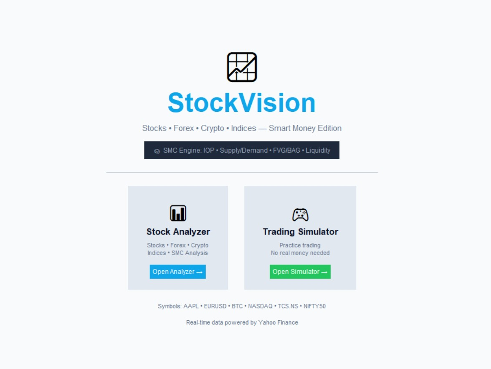
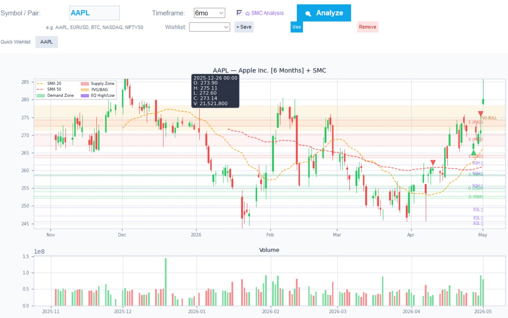
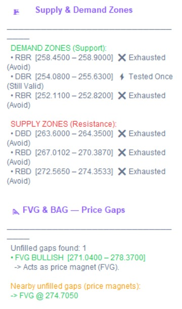
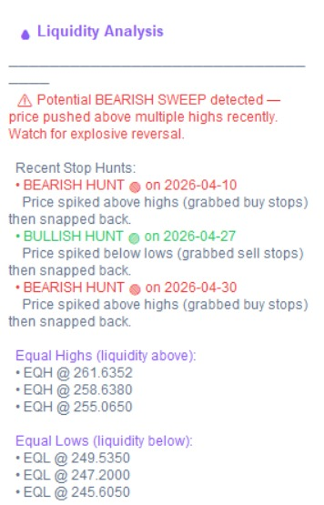
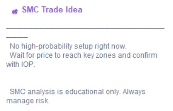

# 📈 StockVision

<div align="center">

# StockVision

### Smart Money Trading Analyzer

**Analyze • Visualize • Interpret**

*Decode Institutional Moves. Trade Smarter.*


</div>

---

<p align="center">
  
</p>

<div align="center">

### Complete StockVision Workspace

Real-Time Market Analysis • Smart Money Concepts • Trading Simulation

</div>

---

# 🚀 Overview

StockVision is a Python-based Smart Money Concepts (SMC) trading analysis platform that helps traders understand institutional market behavior across Stocks, Forex, Cryptocurrencies, ETFs, and Global Indices.

Unlike traditional trading tools that rely heavily on lagging indicators, StockVision focuses on interpreting market structure, liquidity movement, price imbalances, and institutional footprints in real time.

The platform combines:

* 📊 Live Market Analysis
* 🧠 Smart Money Concepts Engine
* 📈 Interactive Chart Visualization
* 💧 Liquidity Analysis
* 🎮 Paper Trading Simulation

into a single desktop application.

> **"We don't predict price. We interpret smart money."**

---

# 🎯 Problem Statement

Retail traders frequently struggle because they depend on indicators that react after the move has already happened.

Common issues include:

* Lack of institutional market understanding
* Emotional decision-making
* Poor risk management
* Inability to identify liquidity zones
* Difficulty interpreting market structure

StockVision bridges the gap between institutional trading logic and retail trader accessibility by translating Smart Money Concepts into an intuitive software platform.

---

# 🏠 Home Screen

The application begins with a clean and intuitive dashboard that provides access to both major modules.

### Features

* Stock Analyzer
* Trading Simulator
* Multi-Market Support
* Smart Money Concepts Integration

<p align="center">
  
</p>

---

# ✨ Key Features

## 📊 Multi-Market Analysis

Analyze a wide range of financial instruments from a single platform.

Supported Markets:

* Stocks
* Forex
* Cryptocurrencies
* ETFs
* Global Indices

Examples:

```text id="v0mk8d"
AAPL
TSLA
BTC
ETH
EURUSD
GBPJPY
NASDAQ
NIFTY50
SENSEX
```

---

## 🧠 Smart Money Concepts Engine

StockVision incorporates institutional-grade Smart Money Concepts including:

### 🔥 Imbalance of Power (IOP)

Analyzes candle anatomy to determine:

* Bullish Power
* Bearish Power
* Trend Candles
* Hidden Institutional Activity
* Market Indecision

### 🟢 Supply & Demand Zones

Detects:

* Rally Base Rally (RBR)
* Drop Base Rally (DBR)
* Rally Base Drop (RBD)
* Drop Base Drop (DBD)

### 🟡 Fair Value Gaps (FVG)

Identifies:

* Market Inefficiencies
* Price Imbalances
* Potential Price Magnets

### 💧 Liquidity Analysis

Detects:

* Liquidity Sweeps
* Stop Hunts
* Equal Highs
* Equal Lows
* Institutional Traps

---

# 📊 Market Analyzer Dashboard

The analyzer combines traditional market analytics with Smart Money Concepts.

### Dashboard Features

* Live Market Data
* Candlestick Charts
* SMA 20
* SMA 50
* Volume Analysis
* RSI Analysis
* Trend Detection
* Risk Assessment

<p align="center">
  
</p>

---

# 📈 Smart Money Chart Visualization

Institutional footprints are visualized directly on the chart.

Displayed overlays include:

* Supply Zones
* Demand Zones
* Fair Value Gaps
* Liquidity Levels
* Equal Highs & Lows
* Stop-Hunt Markers

The visualization layer allows traders to understand where significant institutional activity may be occurring.

---

# 🟢 Supply & Demand Zones + Fair Value Gaps

The system automatically detects potential institutional buying and selling zones.

### Zone Analysis Includes

* Pattern Type Detection
* Zone Freshness
* Retest Validation
* Strength Evaluation
* Nearby Fair Value Gaps

<p align="center">
  
</p>

---

# 💧 Liquidity Analysis

One of the most powerful components of StockVision.

The Liquidity Engine continuously scans for:

* Stop Hunts
* Liquidity Grabs
* Liquidity Sweeps
* Equal Highs (EQH)
* Equal Lows (EQL)
* Potential Reversal Traps

Helping traders identify where large market participants may be targeting liquidity.

<p align="center">
  
</p>

---

# 📋 SMC Trade Decision Engine

Multiple Smart Money signals are combined into a final interpretation layer.

The engine evaluates:

* Imbalance of Power
* Supply & Demand Zones
* Fair Value Gaps
* Liquidity Conditions
* Market Structure

Based on the combined analysis, StockVision generates trade ideas or recommends waiting for higher probability setups.

> Sometimes the best trade is no trade.

<p align="center">
  
</p>

---

# 🎮 Paper Trading Simulator

StockVision includes a paper trading environment that allows traders to practice and validate strategies without risking real capital.

### Features

* Virtual Balance
* Position Management
* Profit/Loss Tracking
* Buy/Sell Simulation
* Strategy Testing

```text id="hh7v9y"
[ INSERT TRADING SIMULATOR SCREENSHOT HERE ]
```

---

# 🏗️ System Architecture

```text id="n9v28u"
Yahoo Finance API
        │
        ▼
 Market Data Engine
        │
        ▼
 Smart Money Engine
 ├─ Imbalance of Power
 ├─ Supply & Demand Zones
 ├─ Fair Value Gaps
 ├─ Liquidity Analysis
 └─ SMC Summary Engine
        │
        ▼
 Visualization Layer
        │
        ▼
 Tkinter Desktop GUI
```

---

# 🛠️ Technology Stack

| Category             | Technology                  |
| -------------------- | --------------------------- |
| Programming Language | Python                      |
| GUI Framework        | Tkinter                     |
| Data Visualization   | Matplotlib                  |
| Data Processing      | Pandas                      |
| Numerical Computing  | NumPy                       |
| Market Data          | Yahoo Finance (yFinance)    |
| Architecture         | Object-Oriented Programming |

---

# 📂 Project Structure

```text id="rhv3ll"
StockVision/
│
├── Code/
│   └──stockvision.py
│
├── Snapshots/
│   ├── working-demo.jpeg
│   ├── homepage.jpeg
│   ├── responsive-graph.jpeg
│   ├── analysis_bar_1.jpeg
│   ├── analysis_bar_supply-demand-fvg.jpeg
│   └── smc_trade_idea.jpeg
│
├── docs/
│   ├── Poster.pdf
│   ├── Presentation.pptx
│   └── Report.pdf
│
├── requirements.txt
│
└── README.md
```

---

# ⚙️ Installation

Clone the repository:

```bash id="clj6iq"
git clone https://github.com/IshaanGarud/StockVision.git

cd StockVision
```

Install dependencies:

```bash id="jopjcc"
pip install yfinance pandas numpy matplotlib
```

Run the application:

```bash id="6f2xj0"
cd Code
python stock_vision.py
```

---

# 🎓 Learning Outcomes

This project demonstrates practical implementation of:

* Smart Money Concepts (SMC)
* Real-Time Financial Data Processing
* Desktop Application Development
* Data Visualization
* Algorithmic Market Analysis
* Object-Oriented Programming
* Trading System Architecture

---

# 🔮 Future Scope

### 🤖 AI-Powered Trade Suggestions

Machine learning-assisted trade setup recommendations.

### ⏪ Backtesting Engine

Historical strategy validation and performance analysis.

### 🌐 Web Application

Browser-based deployment.

### 📱 Mobile Application

Cross-platform trading companion.

### ☁️ Cloud Synchronization

Online watchlists and user profiles.

### 📡 Real-Time Alerts

Notifications for:

* Liquidity Sweeps
* Supply & Demand Retests
* Fair Value Gap Formation
* High Probability Trade Setups

---

# 👨‍💻 Team Pythoneers

### Don Bosco Institute of Technology, Mumbai

| Name          | Role                                               |
| ------------- | -------------------------------------------------- |
| Mahie Jain    | Lead Developer, UI/UX Designer & Workflow Engineer |
| Ishaan Garud  | Co-Developer & Core System Engineer                |
| Rupsagar Kar  | Smart Money Concepts Analyst & System Designer     |
| Stella Ghodke | Research & Documentation Specialist                |

### Project Guide

**Prof. Imran Ali Mirza**

Department of Computer Science
Don Bosco Institute of Technology, Mumbai

---

# 📜 License

This project is licensed under the MIT License.

See the LICENSE file for details.

---

<div align="center">

## ⭐ If you found this project interesting, consider giving it a star!

### StockVision

#### Smart Money Trading Analyzer

*"The future of trading is interpretation, not prediction."*

</div>
